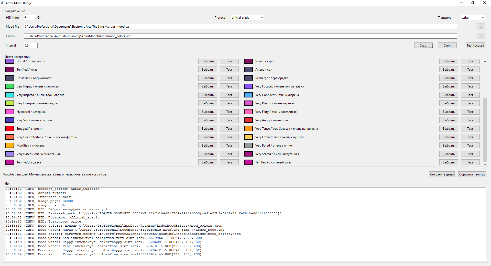

# Ardor Mood Bridge

Ardor Mood Bridge connects **The Sims 4 active Sim emotions** to an **ARDOR Guardian** RGB keyboard.

The Sims 4 script mod writes the active Sim mood to a small text file. The bridge reads that file and sends the matching RGB color directly to the ARDOR keyboard over HID.



## Status

Tested setup:

- Keyboard: `ARDOR_Guardian`
- HID IDs: `VID_320F PID_5055`
- RGB HID interface: usually `HID index = 4`, `usage_page = 0xFF1C`
- Working protocol: `official_static`
- Working transport: `write`
- Recommended brightness: `4`
- Game: The Sims 4, Windows

This is an experimental fan project. It is not affiliated with ARDOR, Razer, Maxis, or EA.

## What It Does

- Watches the active Sim mood in real time.
- Changes the ARDOR Guardian keyboard static RGB color.
- Supports normal, very, and extreme emotion states.
- Lets you customize every mood color in a small Windows GUI.
- Saves custom colors to `%APPDATA%\ArdorMoodBridge\mood_colors.json`.
- Can be built into a standalone Windows `.exe`.
- Includes a Sims 4 script mod source and builder.

Recommended flow:

```text
The Sims 4 script mod -> ardor_mood.txt -> ArdorMoodBridge.exe -> ARDOR Guardian HID
```

## Supported Moods

Base moods:

```text
Fine
Happy
Focused
Inspired
Confident
Energized
Playful
Flirty
Sad
Angry
Tense / Stressed
Uncomfortable
Embarrassed
Bored
Dazed
Scared
Terrified
Asleep
Possessed
Recharge
```

Intense and alternate names:

```text
Very Happy
Very Focused / In the Zone
Very Inspired / Imaginative
Very Confident / Fearless
Very Energized / Pumped
Very Playful / Silly
Hysterical
Very Flirty / Passionate
Very Sad / Depressed
Very Angry / Furious
Enraged
Very Tense / Stressed
Very Uncomfortable / Miserable
Very Embarrassed / Humiliated
Mortified
Very Bored
Very Dazed
Very Scared
Terrified+
```

The Sims mood intensity from `sim_info.get_mood_intensity()` is treated as:

```text
0 = normal
1 = very
2 = extreme
```

## Quick Start

### 1. Install the Sims Mod

Build the Sims script mod on Windows with Python 3.7:

```powershell
cd sims_mood_mod
powershell -ExecutionPolicy Bypass -File .\build_ts4script_py37.ps1
```

Copy the built file to:

```text
Documents\Electronic Arts\The Sims 4\Mods\ArdorMood.ts4script
```

In The Sims 4 settings enable:

```text
Enable Custom Content and Mods
Script Mods Allowed
```

Restart the game after changing these settings.

The mod writes:

```text
Documents\Electronic Arts\The Sims 4\ardor_mood.txt
Documents\Electronic Arts\The Sims 4\ardor_mood_mod.log
```

### 2. Build the Windows App

Use Python 3.12 or 3.11 for the Windows app build. Python 3.13 may try to compile `hidapi` from source and require Microsoft Visual C++ Build Tools.

Install Python 3.12 if needed:

```powershell
winget install Python.Python.3.12
```

From the project root on Windows:

```powershell
powershell -ExecutionPolicy Bypass -File .\build_exe.ps1
```

The app will be created at:

```text
dist\ArdorMoodBridge.exe
```

### 3. Run the Bridge

Open `dist\ArdorMoodBridge.exe`.

Recommended settings for the tested ARDOR Guardian:

```text
HID index: 4
Protocol: official_static
Transport: write
Brightness: 4
Interval: 0.2
```

Press:

```text
Тест focused
```

If the keyboard changes color, press:

```text
Старт
```

Leave the bridge open while playing. Use `Стоп` to stop watching without closing the app.

## Color Customization

Each mood row has:

- `Выбрать` - choose a custom color.
- `Тест` - immediately send that mood color to the keyboard.

Global actions:

- `Сохранить цвета` - saves the palette.
- `Сбросить палитру` - restores defaults after a confirmation dialog.

Custom colors are stored in:

```text
%APPDATA%\ArdorMoodBridge\mood_colors.json
```

An example palette is included:

```text
mood_colors.example.json
```

## Running Without EXE

Install dependencies:

```powershell
pip install flask hidapi
```

List HID interfaces:

```powershell
python ardor_chroma_bridge.py --list
```

Test RGB:

```powershell
python ardor_chroma_bridge.py --path-index 4 --protocol official_static --transport write --test
```

Run only the mood watcher, without Flask:

```powershell
python ardor_chroma_bridge.py --path-index 4 --protocol official_static --transport write --brightness 4 --mood-watch --mood-interval 0.2 --no-server
```

Run with the Chroma REST emulator enabled:

```powershell
python ardor_chroma_bridge.py --path-index 4 --protocol official_static --transport write --brightness 4 --mood-watch --mood-interval 0.2
```

## Project Layout

```text
ardor_chroma_bridge.py       HID bridge, Flask routes, mood watcher
ardor_mood_bridge_gui.py     Tkinter GUI used for the exe
ardor_mood_colors.py         Default palette, aliases, JSON config support
build_exe.ps1                PyInstaller build script
mood_colors.example.json     Example palette
sims_mood_mod/               Sims 4 script mod source and builder
sims_chroma_stub/            Optional reverse-engineering DLL stub source
docs/                        Screenshots and documentation assets
```

## Notes About the DLL Stub

`sims_chroma_stub/` is kept only as reverse-engineering history. It was used to inspect how The Sims 4 calls `CChromaEditorLibrary64.dll`.

For normal use, do not replace the game DLL. The current recommended solution is the Sims script mod plus `ArdorMoodBridge.exe`.

If you previously replaced `CChromaEditorLibrary64.dll`, restore the original:

```cmd
cd "D:\Games\The Sims 4\Game\Bin"
del CChromaEditorLibrary64.dll
ren CChromaEditorLibrary64.original.dll CChromaEditorLibrary64.dll
```

## Troubleshooting

If the keyboard does not change color:

1. Press `Тест focused` in the app.
2. If the test fails, check `HID index`, `Protocol`, `Transport`, and `Brightness`.
3. If the test works but Sims moods do not, check:

```powershell
Get-Content "$env:USERPROFILE\Documents\Electronic Arts\The Sims 4\ardor_mood.txt"
Get-Content "$env:USERPROFILE\Documents\Electronic Arts\The Sims 4\ardor_mood_mod.log" -Tail 80
```

If `ardor_mood.txt` changes but the keyboard does not, the issue is in the bridge/HID side.

If `ardor_mood.txt` does not change, the issue is in the Sims script mod installation or Sims settings.

If the keyboard changes color but looks too dim, set `Brightness` to `4`. The bridge sends brightness together with every static-color packet, so a lower value can override the keyboard brightness selected by hardware keys or the official utility.

## Credits / References

- Sims 4 mood access: `sim_info.get_mood()` and `sim_info.get_mood_intensity()`.
- ARDOR Guardian static RGB packets were derived from USBPcap captures of the official ARDOR utility.
- Emotion phase references were checked against Sims community documentation while building the mood alias table.
